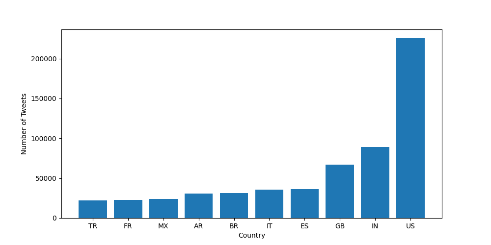
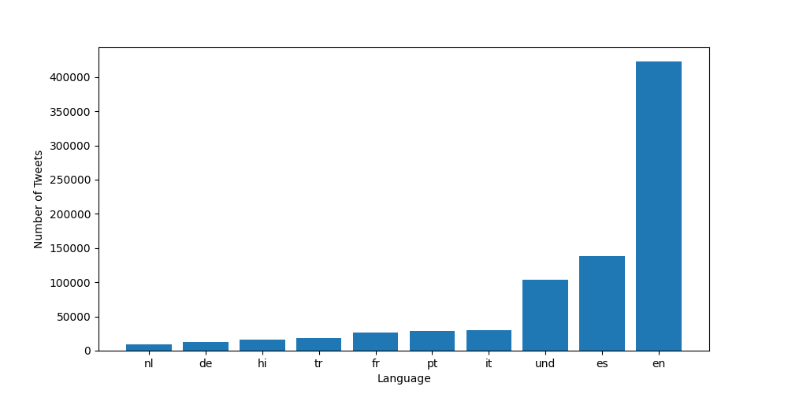
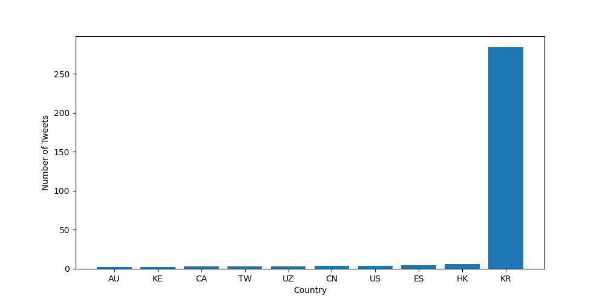

## Coronavirus Twitter Analysis
This project included scanning all geotagged tweets sent in 2020 to monitor the spread of coronavirus on social media. The process included:
* Working with large scale datasets
* Working with multilingual text
* Using the MapReduce divide-and-conquer paradigm to create parallel code

### Findings:

