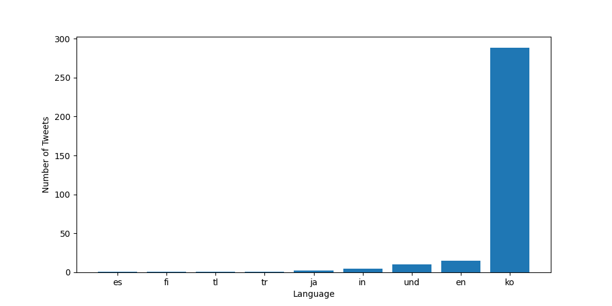
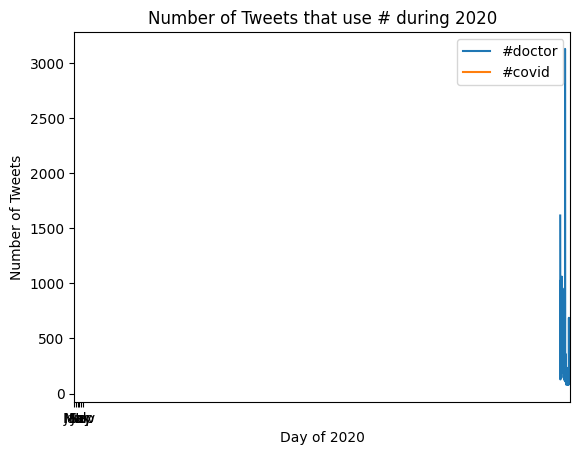

## Coronavirus Twitter Analysis
This project included scanning all geotagged tweets sent in 2020 to monitor the spread of coronavirus on social media. The process included:
* Working with large scale datasets
* Working with multilingual text
* Using the MapReduce divide-and-conquer paradigm to create parallel code

### Process:
1. Created a mapper that tracks the usage of the hashtags on both a language and country level. The output of running them mapper included two files, one for the langauge dictionary and one for the country dictionary.
2. Created shell scrip to loop over each file in the dataset and run the mapper on each file. (utilized the nohup command to ensure the program continued to run after any disconnect)
3. Reduced mapped files to combine all .lang files into a single file and all .country files into a different file. 
4. Visualized output files of the MapReduce process as bar graphs. The horizontal axis of bar graph included keys of input file and the vertical axis included values of the input file. This included only the top 10 keys.
5. Created an alternative visualization file to combine the reduce and visualization steps. This file takes a list of hashtags as input and outputs a line plot.

### Findings:
To visualize output files of MapReduce, I set the `--input_path` equal to both the country and lang files created in the reduce phase, and the `--key` to `#coronavirus` and `#코로나바이러스`.
|  | 
|:--:| 
| *Mentions of Coronavirus by Country* |

|  | 
|:--:| 
| *Mentions of Coronavirus by Language* |

|  |
|:--:|
| *Mentions of 코로나바이러스 by Country* |

|  |
|:--:|
| *Mentions of 코로나바이러스 by Language* |

|  |
|:--:|
| *Number of Tweets of #hashtag during year by Day of Year* |

