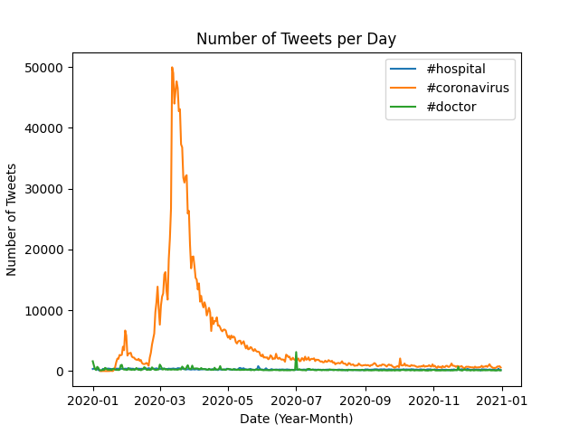

## Coronavirus Twitter Analysis
This project included scanning all geotagged tweets sent in 2020 to monitor the spread of coronavirus on social media. The process included:
* Working with large scale datasets
* Working with multilingual text
* Using the MapReduce divide-and-conquer paradigm to create parallel code

### Process:
1. Created a mapper, `src/map.py` that tracks the usage of the hashtags on both a language and country level. The output of running them mapper included two files, one for the langauge dictionary and one for the country dictionary.
2. Created shell scrip `run_maps.sh` to loop over each file in the dataset and run the mapper on each file. (utilized the nohup command to ensure the program continued to run after any disconnect)
3. Reduced mapped files to combine all `.lang` files into a single file and all `.country` files into a different file. This was done using `src/reduce.py`. 
4. Visualized output files of the MapReduce process as bar graphs using `visualize.py`. The horizontal axis of bar graph included keys of input file and the vertical axis included values of the input file. This included only the top 10 keys.
5. Created an alternative visualization file, `src/alternative_reduce.py` to combine the reduce and visualization steps. This file takes a list of hashtags as input and outputs a line plot.

### Findings:
To visualize output files of MapReduce, I set the `--input_path` of the `visualize.py` file equal to both the country and lang files created in the reduce phase, and the `--key` to `#coronavirus` and `#코로나바이러스`. Results are arranged low to high.
|  | 
|:--:| 
| *Mentions of Coronavirus by Country* |
|In this figure we can see the number of tweets that mention coronavirus for each country. The country with the largest number of tweets is shown to be the United States and the smallest is Türkiye.|

|  | 
|:--:| 
| *Mentions of Coronavirus by Language* |
|In this figure, we can see the top 10 languages of tweets mentioning coronavirus. English is shown to be the language with the largest number of tweets and Dutch is the smallest.|

|  |
|:--:|
| *Mentions of 코로나바이러스 by Country* |
|In this figure, we see the number of tweets that mention 코로나바이러스 by country. We can see that Korea has the largest number of tweets mentioning 코로나바이러스 and Australia has the smallest.|

|  |
|:--:|
| *Mentions of 코로나바이러스 by Language* |
|In this figure, we can see that the language that mentions 코로나바이러스 the most is Korean. Alternatively, the language that mentions 코로나바이러스 the least is Spanish.

|  |
|:--:|
| *Number of Tweets of #hashtag during year by Day of Year* |
|In this figure, we can see the number of tweets a specified hashtag was mentioned per day. Noticeable highlights is during July 2020, #doctor spiked to over 3000 tweets.|

